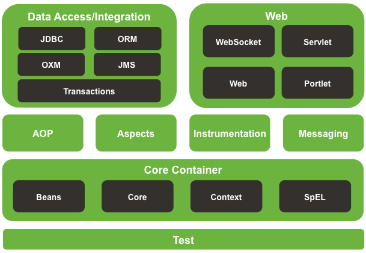

# Hashing Interview Q
#### Q1) What is hashMap?
If you have a key value pair type of data storing them in an array will be a waste of space.

eg  Myvin->97674532 Clea->8974844 over here we would have to make two list and link them with the same index and any alteration in one list would affect the key value pairs.

eg 1->45 40->78 over here we have 1 and 40 as key in an array we would simply have to create extra spaces if using one array

To avoid this we use HashTables( Fancy word for array) where in the principle of hashing is used a particular hash function gives the index of the bucket where the key value pair will be stored.  
A hash function should be determinsitic (it shouldn't change for a given value).

#### Q2)What is a capacity and load factor for a HashMap?
When a HashMap is instantiated there are two parameters that will affect its performance: initial capacity and load factor.
Capacity is the number of buckets/bins in the hash table.
While the load factor measures how many values the hash table is allowed to get before capacity is automatically increased.  
When the amount of items in the table is greater and the load factor and the capacity, the table is rehashed. Meaning the structure of the data is rebuilt with twice the number of buckets specified in the instantiation.  
Java has a load factor of 0.75.

#### Q3)What is Collision?
Since a hash function gets us a small number for a key which is a big integer or string, there is a possibility that two keys result in the same value. The situation where a newly inserted key maps to an already occupied slot in the hash table is called collision and must be handled using some collision handling technique.

#### Q4)How to handle Collisions?
##### Separate Chaining: 
The idea is to make each cell of hash table point to a linked list of records that have same hash function value.
##### Open Addressing: 
In Open Addressing, all elements are stored in the hash table itself. So at any point, size of the table must be greater than or equal to the total number of keys (Note that we can increase table size by copying old data if needed).  
Types of ways     
* Linear Probing
* Quadratic Probing 
* Double Hashing 
# SpringBoot Q

####Q1)What is loose coupling and tight coupling?
#### Q)What is dependency Injection or inversion of control?
#### Q2)What are IOC containers and roles?
Two Type of containers 
* BeanFactory : Basic Features
* ApplicationContext: Spring Aop,WebApplicationContext(Request,Session,SessionScopeetc ) for web applications.

Uses
Genrally ApplicationContext is used cause it has extra features only when there is a memory constrain we use beanFactory.  
Roles 
* Find Beans.
* Wire Dependencies.
* Manage Lifecycle of the Bean.  
#### Q3)What is a scope of a bean?
* Singleton : One instance per Spring Context
* Prototype : New Bean created whenever requested.
* Request : One Bean per Http request . Web-aware SpringApplicationContext.
* Session : One Bean per Http session .Web-aware
Default scope of a bean is Singleton
Spring beans are not thread safe.
#### Q4)Constructor Injection vs Setter Injection
Constructor injection has mandatory dependency also it helps to create an immutable bean which is created at one time unlinke setter.
#### Q5)What is Primary ,Qualifier?
It is used when there is more than one bean to inject for a particular dependency.
* Primary : Gives priority to the bean to come first.
* Qualifier : Gives the bean a name used while defining and calling.      
#### Q5)What are the Spring Modules?
  

